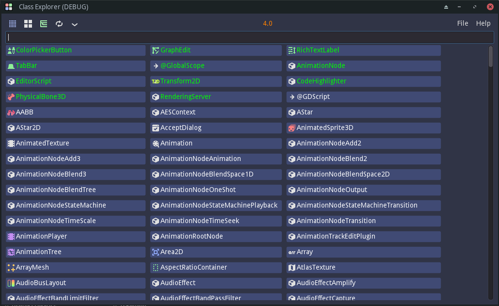
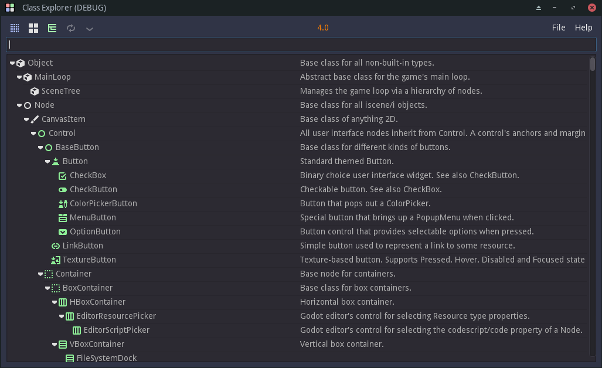
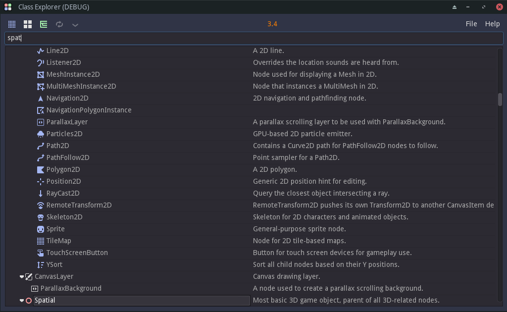
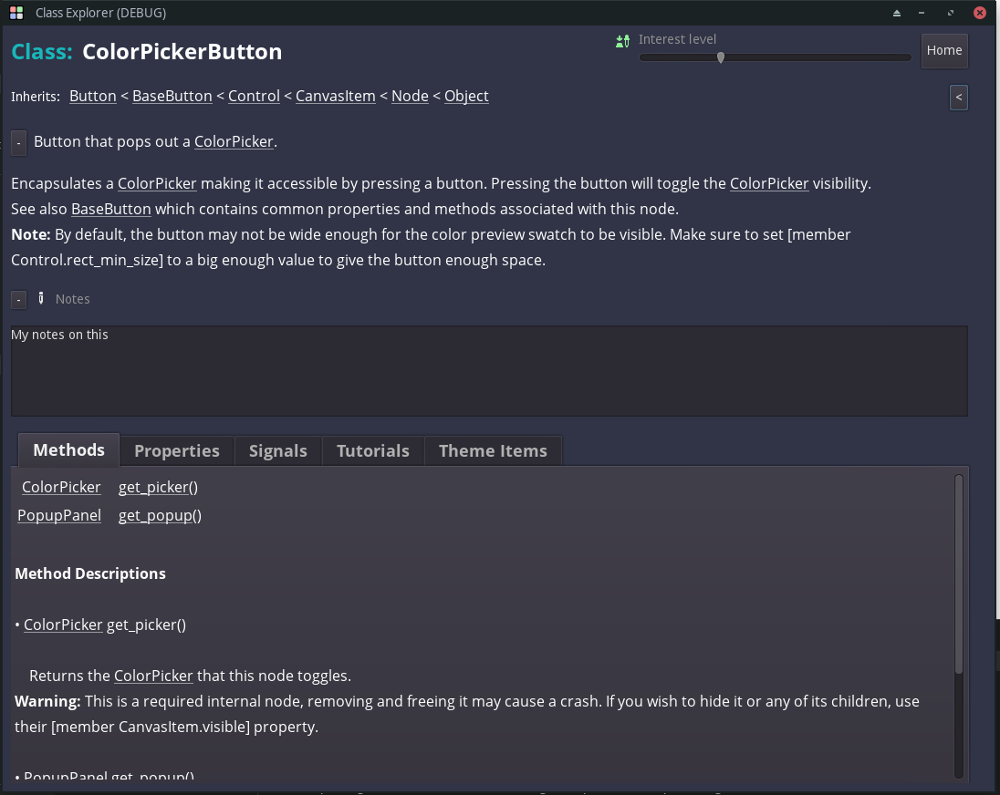

# GDScript Class Explorer

Desktop PC App for personalized exploration of Godot GDScript Classes.

* Download (in-App) any Godot version of the source code
* Extract the data for the Docs
* Select which version that you want to examine
* Explore the class docs in Grid or Tree mode
* View class details in a tabbed scene
* Add your personal notes to any class details page
* Favorite them with a weighting factor
* Your favorites are highlighted in green
* Randomly spin the grid items to discover new things
* Reset the weighting factors individually (right-click), or on mass

* *C# code snippets are also displayed when present*

## The Button Grid View

## The Tree View

## The Tree View with a search

## The Class Details View with Tabs

